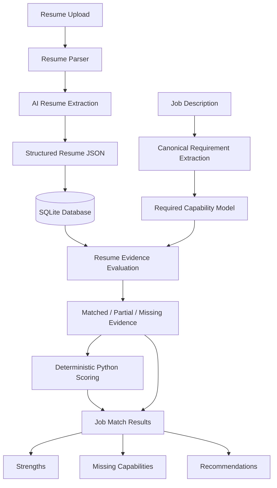
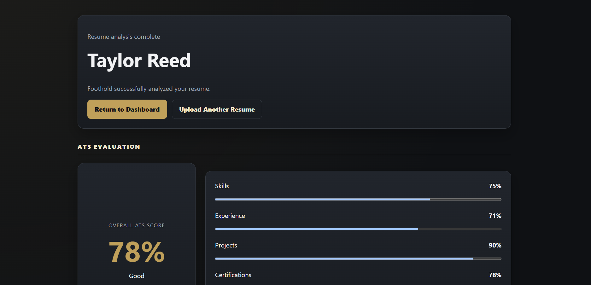
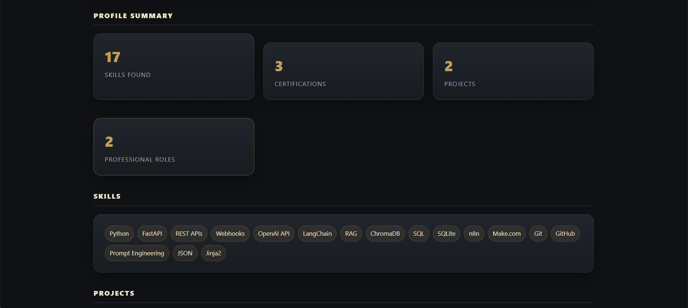
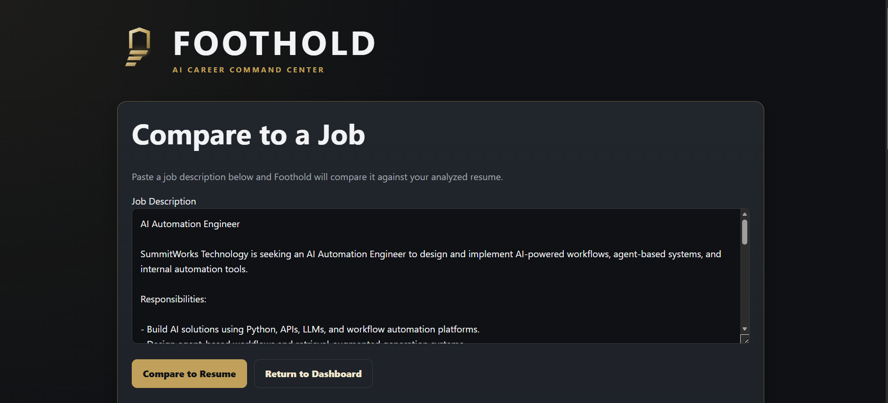
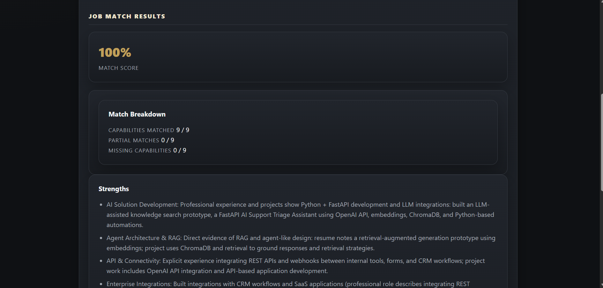

# Foothold

### AI Career Command Center

Foothold is an AI-powered career assistant built to help job seekers evaluate how well their resume aligns with specific job opportunities.

Instead of relying on a generic resume score or asking an LLM to produce an unexplained percentage, Foothold separates resume analysis, job requirement extraction, evidence evaluation, and scoring into distinct stages.

The result is a more explainable job-match workflow that shows **why** a candidate matches a role, where their experience is partial, and which capabilities may need strengthening.

---

## Features

### Resume Analysis

Upload a resume and convert it into structured career data including:

- Skills
- Certifications
- Professional experience
- Projects
- Education

Resume extraction uses a strict structured-data prompt designed to avoid inventing or embellishing information.

---

### Resume Readiness

Foothold evaluates the completeness of the analyzed resume and identifies areas that may improve its effectiveness before applying.

This score is intentionally separate from job-specific matching.

A resume can be strong overall while still being a weak match for a particular role.

---

### Job Match Analysis

Paste a job description and Foothold compares it against the most recently analyzed resume.

The system evaluates the candidate across standardized capability areas such as:

- AI Solution Development
- Agent Architecture & RAG
- AI Platform Administration
- Enterprise Integrations
- Data Pipelines
- API & Connectivity
- Workflow Automation
- Debugging & Root-Cause Analysis
- Monitoring & Observability
- Documentation & Enablement

Each required capability is classified as:

- **Matched**
- **Partial**
- **Not Matched**

Professional experience and education requirements are evaluated separately.

---

### Explainable Match Score

Foothold does not ask an LLM to invent the final match percentage.

Instead, AI is used to extract and evaluate evidence while deterministic Python code calculates the final score.

Current weighting:

| Category | Weight |
|---|---:|
| Technical Capabilities | 60% |
| Professional Experience | 30% |
| Education | 10% |

Capability scoring:

| Status | Score |
|---|---:|
| Matched | 100% |
| Partial | 50% |
| Not Matched | 0% |

This architecture makes the final score reproducible and easier to explain.

---

## Architecture



---

## Why the Scoring Architecture Matters

An early version of Foothold allowed the language model to interpret the job description and generate a match score directly.

That created an important engineering problem:

**The same resume and job description could produce substantially different scores across repeated evaluations.**

Moving to structured output fixed the shape of the response, but it did not completely solve semantic inconsistency. The model could still split requirements differently between runs.

For example, one evaluation might treat several enterprise platforms as one integration capability while another might treat them as several independent requirements.

Foothold solves this by mapping job descriptions into a fixed set of **canonical capability categories**.

The AI determines which capabilities are required and evaluates supporting resume evidence, but it cannot arbitrarily change the scoring categories.

The final score is then calculated entirely in Python.

This separates:

**AI judgment**

from

**application logic**

and produces a much more stable and auditable result.

---

## System Design

Foothold follows a service-oriented FastAPI structure designed around separation of concerns.

### Routes

Handle HTTP requests and coordinate application workflows.

### Services

Contain resume parsing, AI interaction, requirement extraction, evidence evaluation, and scoring logic.

### Models

Define persistent application data using SQLAlchemy.

### Templates

Render the user interface using Jinja2.

### Database

Stores structured resume analysis data in SQLite.

This keeps individual components focused and makes future changes easier to isolate.

---

## Technology Stack

### Backend

- Python
- FastAPI
- SQLAlchemy
- SQLite
- Uvicorn

### AI

- OpenAI Responses API
- Structured JSON Schema output
- Prompt-based information extraction
- Evidence-based job matching

### Frontend

- Jinja2
- HTML
- CSS

### Development

- Git
- GitHub
- VS Code
- Python virtual environments

---

## Project Structure

```text
foothold/
│
├── app/
│   ├── database/
│   ├── models/
│   ├── routes/
│   ├── services/
│   ├── static/
│   │   ├── foothold-logo.svg
│   │   └── style.css
│   ├── templates/
│   │   ├── analysis_results.html
│   │   ├── analyze_resume.html
│   │   ├── home.html
│   │   ├── job_match.html
│   │   └── upload.html
│   └── resumes/
│
├── database/
├── docs/
├── generated/
├── scripts/
├── tests/
│
├── .gitignore
├── main.py
└── README.md
```

---

## Job Matching Pipeline

The job comparison workflow is divided into several independent stages.

### 1. Resume Extraction

The uploaded resume is converted into structured JSON.

The extraction prompt is intentionally conservative:

- Information must come from the resume
- Projects remain separate from professional employment
- Missing information remains empty
- Technologies are not inferred
- Learning-stage skills remain labeled appropriately

### 2. Job Requirement Extraction

The job description is mapped into a fixed set of capability categories.

Specific technologies named by an employer are preserved as details within those categories.

This prevents different LLM runs from creating different scoring denominators.

### 3. Resume Evidence Evaluation

Foothold compares the structured resume against each required capability.

Evidence is classified as:

```text
Matched
Partial
Not Matched
```

Experience and education requirements are evaluated independently.

### 4. Deterministic Scoring

Python converts those classifications into weighted numeric scores.

The LLM never generates the final percentage.

### 5. Explainable Results

The interface presents:

- Overall match score
- Capability breakdown
- Experience match
- Education match
- Candidate strengths
- Missing capabilities
- Improvement recommendations

---

## Running Foothold Locally

Clone the repository:

```bash
git clone https://github.com/JamesLeonard-AI/Foothold.git
cd Foothold
```

Create a virtual environment:

```bash
python -m venv venv
```

Activate it.

### Windows PowerShell

```powershell
.\venv\Scripts\Activate.ps1
```

Install dependencies:

```bash
pip install -r requirements.txt
```

Create a `.env` file:

```text
OPENAI_API_KEY=your_api_key_here
```

Run the application:

```bash
uvicorn main:app --reload
```

Open:

```text
http://127.0.0.1:8000
```

---

## Screenshots

### Dashboard

Foothold's main dashboard provides system status, resume intake, and career opportunity views.


### Resume Analysis

Uploaded resumes are converted into structured career data and evaluated for overall resume readiness.



### Candidate Profile

Foothold extracts skills, certifications, projects, professional experience, and education into a structured candidate profile.



### Job Comparison

Users can paste a job description to compare its requirements against the analyzed resume.



### Explainable Job Match

Foothold evaluates canonical capabilities and calculates the final score with deterministic Python logic.


---

## Known Limitations

Foothold is currently an MVP and is not intended to reproduce scoring systems used by LinkedIn, applicant tracking systems, or individual employers.

Current limitations include:

- AI evidence classification may still vary slightly between evaluations
- Education equivalency interpretation may vary for ambiguous job descriptions
- Job descriptions must currently be pasted manually
- Job search is not yet automated
- Match history is not yet stored for analytics
- Resume tailoring is not yet automated
- The scoring model has not yet been calibrated against a large labeled evaluation dataset

These limitations are intentionally documented rather than hidden behind an artificial precision claim.

---

## Roadmap

Planned future capabilities include:

- Automated job discovery
- Saved job opportunities
- Match-history tracking
- Career analytics dashboard
- Resume tailoring recommendations
- Job-specific resume optimization
- Interview preparation
- Application tracking
- Requirement extraction caching
- Evaluation datasets for scoring calibration
- Expanded observability and AI evaluation tooling

The long-term goal is to turn Foothold into a complete AI-assisted job-search workflow while maintaining human control over application decisions.

---

## Engineering Lessons

Building Foothold reinforced several important AI engineering principles:

### Structured output does not guarantee semantic consistency

JSON schemas solve formatting problems, but they do not automatically solve differences in model interpretation.

### LLMs should not control deterministic application logic

AI works well for interpreting text and evaluating qualitative evidence.

Business rules and scoring calculations are better handled by deterministic code.

### Canonicalization improves reliability

Mapping variable natural-language requirements into fixed capability categories dramatically reduces scoring instability.

### Separation of concerns makes AI systems easier to debug

Resume extraction, requirement extraction, evidence evaluation, scoring, persistence, routing, and presentation are intentionally separated.

When behavior changes unexpectedly, the responsible component can be tested independently.

### Explainability matters

A match percentage is far more useful when the user can see the evidence that produced it.

---

## Project Status

**MVP — Active Development**

Current end-to-end workflow:

```text
Upload Resume
      ↓
Analyze Resume
      ↓
Store Structured Profile
      ↓
Paste Job Description
      ↓
Extract Required Capabilities
      ↓
Evaluate Resume Evidence
      ↓
Calculate Deterministic Match Score
      ↓
Display Strengths, Gaps, and Recommendations
```

---

## Author

**James Leonard**

AI Automation Engineer

GitHub: [JamesLeonard-AI](https://github.com/JamesLeonard-AI)

---

## License

This project is currently intended as a portfolio and experimental software project.